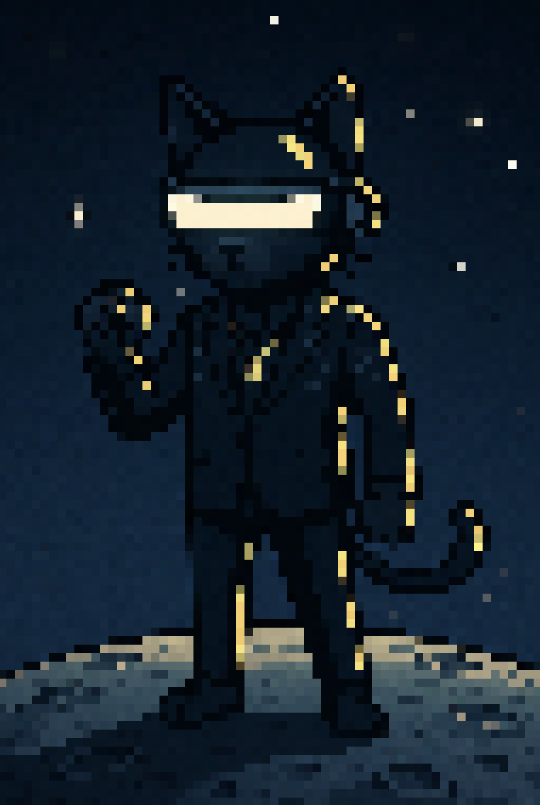

PROTOCOL: QXBwcm9hY2hpbmcgZmluYWwgZGVzdGluYXRpb24u  
PROTOCOL: Tm9kZSBsaW5rZWQuIERlY3J5cHRpbmcgY29kZWJhc2Uu

# Welcome, space explorer!

## About Me

Here’s a quick snapshot of who I am:

- I enjoy working close to the metal: systems programming, performance tuning, and memory management
- I build scalable full-stack apps with a strong focus on system design, secure CI/CD, and cloud infrastructure
- I explore ML concepts like efficient data processing, core algorithm implementations, and the math behind it
- I'm passionate about security—CTFs, securing projects, and keeping up with latest vulnerabilities and mitigations

## Skills

### Core Stack

  

  
For more skills, click me.

### Previously Used

  

### Currently Learning

  

### Interested In

  

## GitHub Stats

Watch my GitHub contributions come alive as a childhood classic:

<picture>
  <source media="(prefers-color-scheme: dark)" srcset="https://raw.githubusercontent.com/emirdur/emirdur/output/github-snake-dark.svg" />
  <source media="(prefers-color-scheme: light)" srcset="https://raw.githubusercontent.com/emirdur/emirdur/output/github-snake.svg" />
  
</picture>

  
For more GitHub stats, click me.

   

<!-- Switch to github-readme-stats? -->
<table align="center">
  <tr>
    <!-- <td>
      
    </td> -->
    <td>
      
    </td>
    <td>
      
    </td>
  </tr>
</table>
<!-- <table align="center">
  <tr>
    <td>
      
    </td>
    <td>
      
    </td>
  </tr>
</table> -->

## Featured Work

This is what I'm currently working on:

<table align="center">
  <tr>
    <td>
      
    </td>
  </tr>
</table>

  
For more projects I've worked on, click me.

   

  <table align="center">
    <tr>
      <td>
       
      </td>
      <td>
        
      </td>
    </tr>
  </table>
  <table align="center">
    <tr>
      <td>
        
      </td>
      <td>
        
      </td>
    </tr>
  </table>
  <table align="center">
    <tr>
      <td>
        
      </td>
      <td></td>
    </tr>
  </table>

## Current Focus

Here's a summary of my active pursuits:

- Building a C++ neural network engine
- Diving into GPU acceleration topics (CUDA, Metal)
- Investigating Spectre & Meltdown side-channels and network attacks
- Tackling CTFs on PicoCTF and exploring mitigations
- Exploring chip-level design and instruction pipelining

  
For more on what I’m building, reading, and thinking about next, click me.

### Currently Building

Building abovo, a C++ neural network engine with Python bindings to teach low-level ML optimization techniques.

### Currently Reading

Looking at GPU acceleration topics using CUDA and Metal. Investigating Spectre & Meltdown side-channel attacks, packet interception techniuqes, and network sniffing (non-offensive).

### Writings & Talks

I'm planning on writing PicoCTF walkthroughs on how to solve certain CTF challenges.

### Up Next

Jumping into chip-level design and isntruction pipelining.

## Thank You

  

  As a token of gratitude for your journey, please accept this postcard. 
   
  <em>Safe travels!</em>

# End of transmission. Launching module in T-10... Bon Voyage!

PROTOCOL: Tm9kZSB1bmxpbmtlZC4gRW5jcnlwdGluZyBjb2RlYmFzZS4=  
PROTOCOL: UHNzdCEgVGhlcmUncyBhbiBlYXN0ZXIgZUAhPw==  
PROTOCOL: V0FSTklORzogU2lnbmFsIGZhZGluZy4g  
PROTOCOL: OWYgdGhpcyBwYSQmIyA=  
PROTOCOL: REVCVUc6IENvbm5lY3Rpb24gTG9zdC4=
